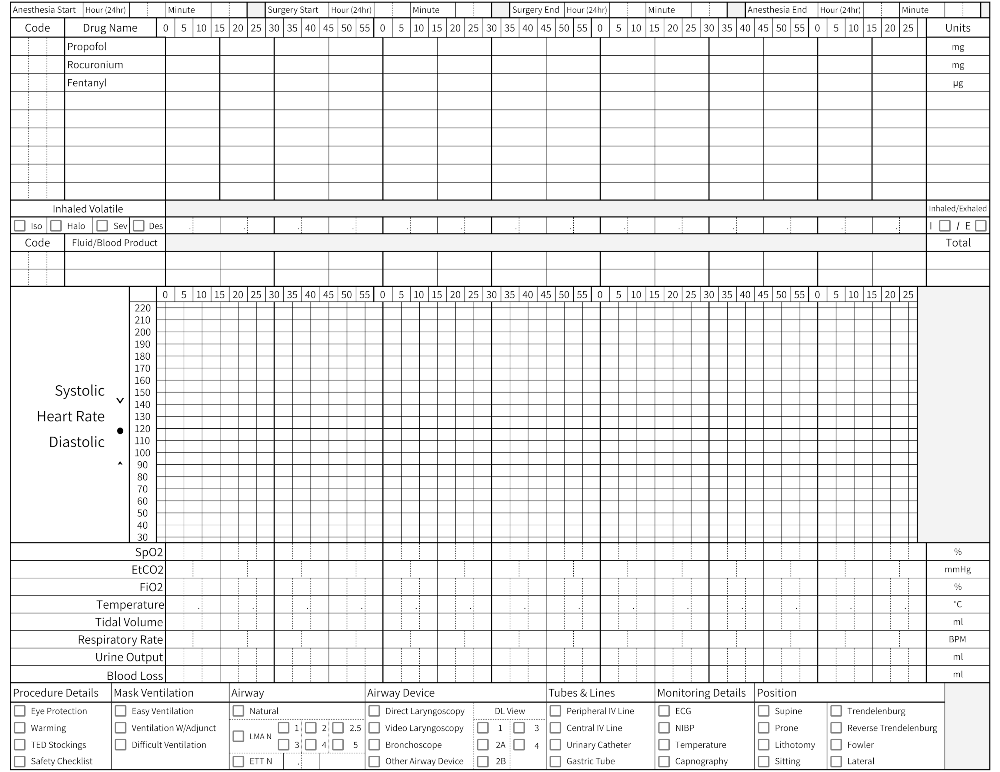
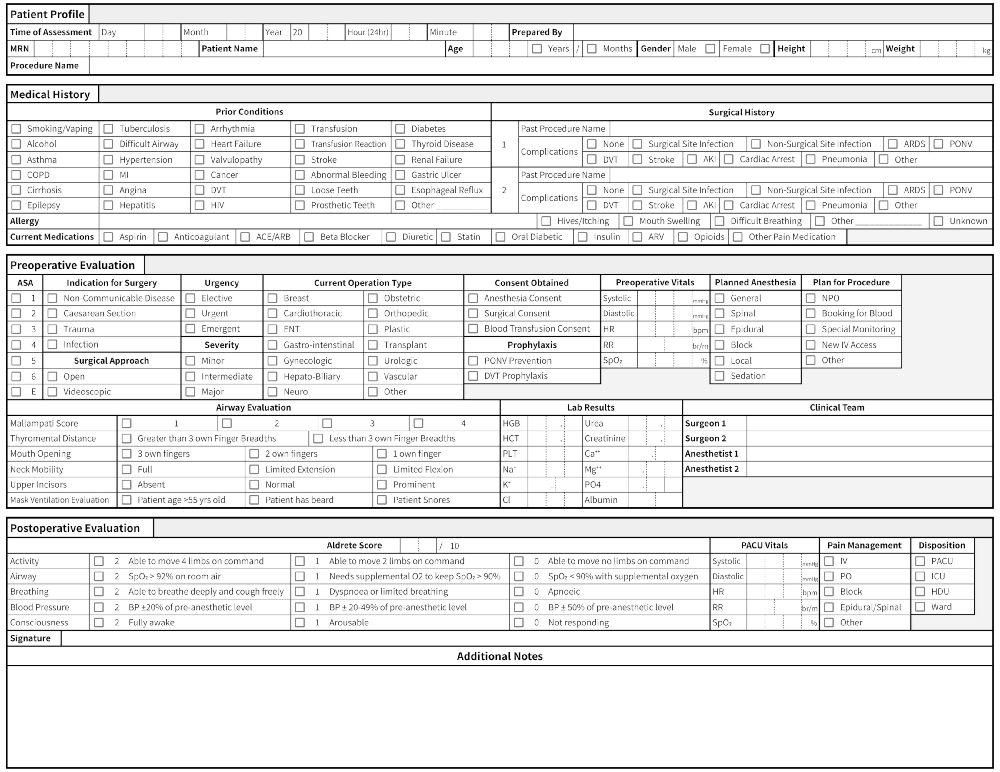

# ChartExtractor
ChartExtractor is a computer vision program that extracts data from smartphone images of paper medical charts.

## Why Does This Exist?

The availability of readily accessible, digital medical data offers two major benefits to institutions: it provides real-time access for informed medical decisions and retrospective data for research. This data allows researchers to:

1. Study statistical associations to uncover socioeconomic, genetic, and environmental factors of health.
2. Quantify how medicine is being used and how practice varies geographically.
3. Create retrospective studies that can then be used for prospective randomized control trials to study causality.

EMRs are now widespread in the west, with 96% adoption in American hospitals and 78% in office-based clinics [National Trends in Hospital and Physician Adoption of Electronic Health Records](https://www.healthit.gov/data/quickstats/national-trends-hospital-and-physician-adoption-electronic-health-records). Their adoption has allowed groups like MPOG and NACOR to form, which amalgamate massive datasets of medical records. These datasets enable researchers to perform large meta-analyses on millions of data points, including studies of uncommon and poorly understood conditions by providing enough data for statistically significant analysis.

Additionally, a physician caring for a patient recovering in an ICU can easily access a hyperlinked version of their surgical case and history, speeding up the application of interventions or tests.

Although these benefits are exceptionally valuable, adopting electronic medical records (EMRs) has four distinct challenges [Challenges of Implementing Electronic Health Records in Resource-Limited Settings](https://www.ncbi.nlm.nih.gov/pmc/articles/PMC5654179/):

1. EMRs are costly.
2. EMRs require training and human capital to implement and maintain.
3. EMRs require sufficient electrical and internet infrastructure to function effectively.
4. EMRs necessitate significant workflow changes.

Due to these challenges, developing nations have been slow to adopt EMRs.

## History
ChartExtractor, a project launched in 2019, offers a non-EMR solution to bridge the gap between having no EMR system, and having a full EMR system. 
This free, easily accessible smartphone application digitizes paper charts, requiring minimal changes to clinical operations. 

This project began in [2019 as a capstone project](https://ieeexplore.ieee.org/document/9106679) as a data science master's capstone at the University of Virginia. 
The goal of this project was to read the data from an paper anesthesia record from the University Teaching Hospital in Kigali, Rwanda using only a smartphone image of it.
Successive years brought new groups who each assessed the feasibility of a new part of the chart, and improved on the work of the previous groups [[1]](https://ieeexplore.ieee.org/document/9106679), [[2]](https://ieeexplore.ieee.org/document/9483723), [[3]](https://ieeexplore.ieee.org/document/9799426), [[4]](https://bmcbioinformatics.biomedcentral.com/articles/10.1186/s12859-024-05785-8).

All this work, however, was for one side of a single chart, at a single site. So, in 2023, we decided to prospectively create our own chart that implemented a workaround the most difficult part of the traditional handwritten anesthesia records: handwritten words.

This repository houses the computer vision code designed to work on the chart that we created. When this repository is finished, a site needs only to adopt the chart in order to have a machine readable anesthesia chart.

## The Paper Anesthesia Record
While we hope to expand to charts from the ICU and beyond, the first chart this program will operate on is the anesthesia record. The anesthesia record has two sides, one to record preoperative and postoperative information, and the other dedicated to only intraoperative data.

### Front

### Back

