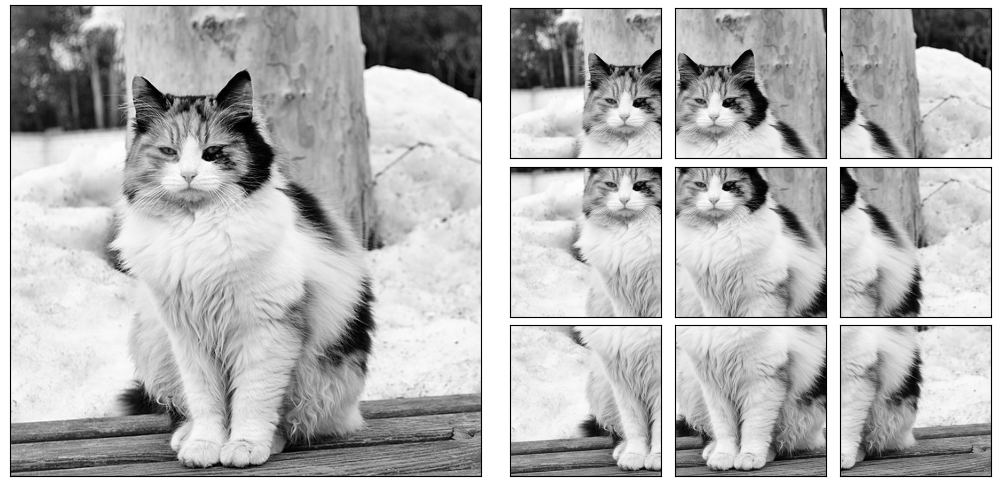

Image Tiling
============

Introduction
############

Motivation
**********
Autonomous driving and aerial drone photography are two very important applications for computer vision. 
Autonomous vehicles, if possible, will reduce traffic fatalities and allow for more comfortable transit, and aeiral drone photography is used extensively in spying and warfare.

Thus, with large financial incentives behind them, these two sources of data have shaped a small niche of computer vision research due to one factor that they both share: *objects in these kinds of datasets are very small relative to the frame*.

.. image:: ../assets/aerial_photo.png
   :width: 100%

(Example of object detection used in aerial photography. Credit to [#]_)

The Technical Issue of Small Objects
************************************
Object detectors, in general, struggle with small object detection [#]_. 
The reasons for this are due to varying factors depending on the exact approach the object detector employs.  

For any object detector which uses convolution as a part of the neural network architecture, their convolutional layers will shrink the size of objects as they pass their outputs to the next layers.
This causes already small objects to shrink even further, which further causes later convolutional kernels to struggle to learn meaningful features.  

A second problem emerges for single shot multibox detectors (SSDs), arguably the most commonly used object detectors [#]_. 

Rather than using a region proposal algorithm, SSDs impose a grid of small squares on the image.
Each grid tile can be responsible for the center of only one object. 
Thus, if objects are too small and there are two or more objects whose centers are in one grid tile, only one will recieve a bounding box, causing accuracy to be poor.  

.. image:: ../assets/yolo_v1_diagram.png
    :width: 100%

(A visual explanation of the YOLO single shot detector's algorithm. A bounding box's center must be 'owned' by one and only one square in the SxS grid. Credit to [#]_.)

Our Solution: Image Tiling
##########################

Image tiling is the solution we implement in this project to deal with the many small objects we need to detect.

How Does Image Tiling Work?
***************************

Image tiling involves splitting a larger image into smaller, overlapping 'tiles'. Here's how it works:

1. **Divide the Image:** The large image is divided into smaller pieces called tiles. In our approach, these tiles overlap halfway with the next tile.
2. **Run Object Detection on Each Tile:** An object detection model is then run on each individual tile separately. This allows the model to focus on a smaller area with higher resolution and a higher density of anchor boxes for the small objects of interest.
3. **Reassemble the Detections:** After processing each tile, the detections (bounding boxes or keypoints) need to be put back together in the context of the original image. This might involve adjusting the positions of the detections based on the tile coordinates.

(An example of image tiling. Each tile has a 50% overlap both horizontally and vertically with other tiles.)

Benefits of Tiling for Small Objects
************************************

Image tiling is very effective for increasing accuracy in datasets with many small objects [#]_. It comes with two main benefits:

1. **Increased Relative Size:** Small objects in a large image occupy a small portion of the total pixels. By dividing the image, the object becomes relatively larger within each tile, making it easier for the model to detect.
2. **Reduced Computational Cost:** Running the model on smaller tiles requires less processing power and memory compared to analyzing the entire high-resolution image at once.

(A 500x500 pixel tile from a ~4000px width image. Smaller objects become much larger relative to the frame when they are tiled.)

Challenges of Tiling
********************

There are, however, some challenges with image tiling. However, our project is minimally affected by them:

1. **Increased Inference Time:** Although processing smaller tiles might be faster individually, the overall inference time can increase due to the need to process multiple tiles and reassemble the results. Our project doesn't need real time detection, so we can afford the extra second or two for inference.
2. **Larger Objects Do Not Fit Into Small Tiles:** If a dataset has large and small objects mixed in with each other, large objects might not be able to fit within a single tile, causing large objects to be discarded entirely. All of the objects we are interested in are small, and roughly the same size, letting us use image tiling without leaving any objects out.
3. **Overlapping Tiles Cause Multiple Detections:** In order to ensure all objects get detected, some level of overlap is required for the tiles. The default in our implementation is a 50% horizontal and vertical overlap. This causes detections to be made multiple times on a single object. Our program uses non-maximum-suppression in conjunction with intersection-over-minimum rather than intersection-over-union to remove duplicate detections.

(Non maximum suppression (NMS) culls overlapping detections to leave us with the bounding box with the highest confidence score from the model. NMS is used in most object detectors,
but we use it after the fact to remove overlapping detections after reassembling the tiled detections. Credit to [#]_.)

Sources
#######
.. [#] https://github.com/SOTIF-AVLab/SinD
.. [#] https://doi.org/10.1155/2020/3189691
.. [#] https://arxiv.org/abs/1512.02325
.. [#] https://leimao.github.io/blog/YOLOs/
.. [#] https://doi.org/10.1109/CVPRW.2019.00084
.. [#] https://doi.org/10.13140/RG.2.2.10266.47046
