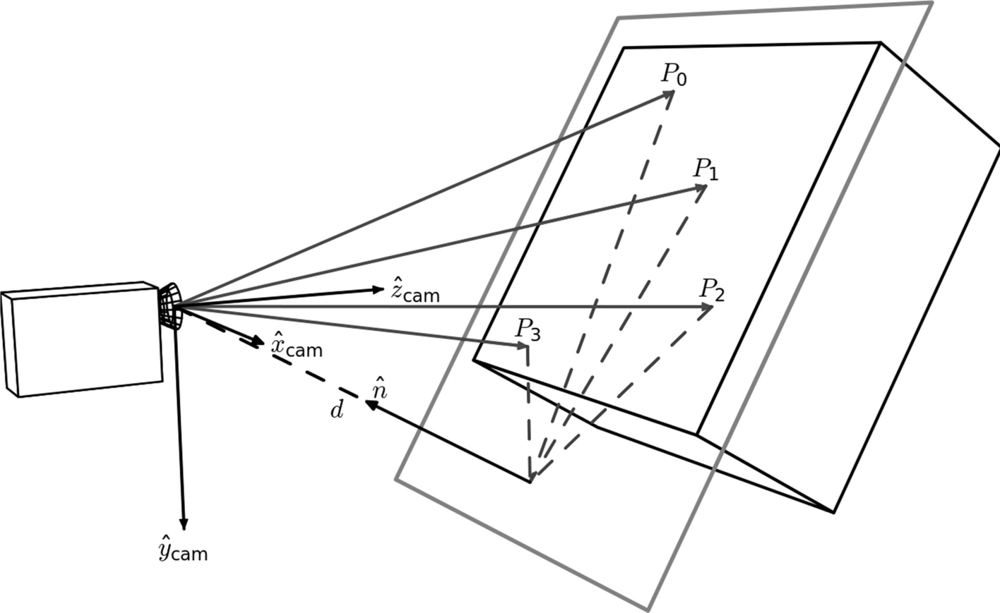
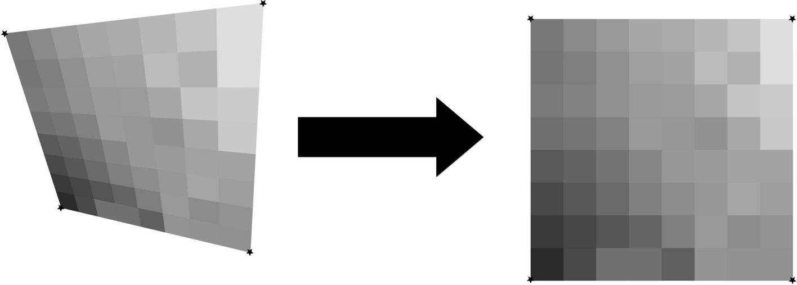

Image Registration
==================

Introduction
############

Motivation
**********
No matter how vigilant the camera operator is, there will be some amount of distortion of the chart added by photography.  
These distortions cause the important document landmarks and data to be in different locations for every photograph of a chart.
Most commonly, these distortions come in the form of linear image deformations due to slightly off angle photography.  

(An example of how cameras introduce distortions to images of flat surfaces. Credit to [#]_)

What is Image Registration?
***************************
Therefore, the photographed image needs an alignment process to take place in order to ensure that the information on the 
document is in roughly the correct location. This process is called "image registration" [#]_.
Image registration can be linear and non-linear, but for our project (at the moment) we are only using linear image registration.

Our Solution: The Homography Transformation
###########################################
There are two main ways to do image registration: intensity-based and feature-based.
Our project uses feature-based methods. Specifically, we employ the homography transformation.
A homography is the most general linear mapping between two quadralaterals.

(A visualization of the homography. The four corners of the left quadralateral are mapped to the right quadralateral, and 
all the points within are warped accordingly.)

In order to compute a homography, we need four points on the "moving" image (also called the "source" image), and four 
points on the "fixed" image (also called the  "destination" image). So, what four points do we use? In our implementation, 
we use four words printed on every chart as these four "anchor" points. The words are subject to change based on what the 
model identifies, but typically they are: "Anesthesia Start" in the top left, "Units" in the top right, "Safety Checklist"
in the bottom left, and "Lateral" in the bottom right. These were chosen to be as far apart from one another as possible to
ensure all of the image could be seen in the photograph.

But how do we get the anchor points on the moving image? Here, we use a YOLOv8 model to identify dozens of document landmarks.
All the landmarks are used, but only four are used here in the image registration step.
The moving image is then warped using OpenCV's homography transformation such that the four document landmarks identified on 
the moving image are aligned to the positions of the fixed image.

Sources
#######
.. [#] https://commons.wikimedia.org/wiki/File:Homography-transl-bold.svg
.. [#] https://en.wikipedia.org/wiki/Image_registration
